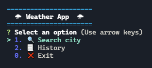
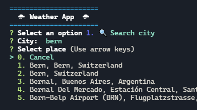
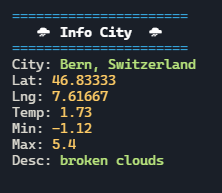

# ☁ **Weather App**

Weather App built with Node.js and uses console as UI. It has the functionality to search for a city and generate information related to the climate of the selected place. Generates a json file as a database.







<br>

## **Built With**

These are the dependencies used for project development.

* <a href="https://www.npmjs.com/package/inquirer" target="_blank">Inquirer</a>
* <a href="https://www.npmjs.com/package/dotenv" target="_blank">Dotenv</a>
* <a href="https://www.npmjs.com/package/axios" target="_blank">Axios</a>
* <a href="https://www.npmjs.com/package/colors" target="_blank">Colors</a>
* <a href="https://www.mapbox.com" target="_blank">Mapbox</a> *(Login and create an API KEY)*
* <a href="https://openweathermap.org" target="_blank">OpenWeather</a> *(Login and create an API KEY)*

</br>

## **How to use**

```bash
# Clone this repository
$ git clone https://github.com/johanmeci/node-weather-app

# Go into the repository
$ cd node-weather-app

# Install dependencies
$ npm install

# Create .env file

# Add MAPBOX_KEY and OPENWEATHER_KEY variables to .env file and add your keys.
MAPBOX_KEY = 'YOUR API KEY'
OPENWEATHER_KEY = 'YOUR API KEY'

# Run the app
$ npm start
```